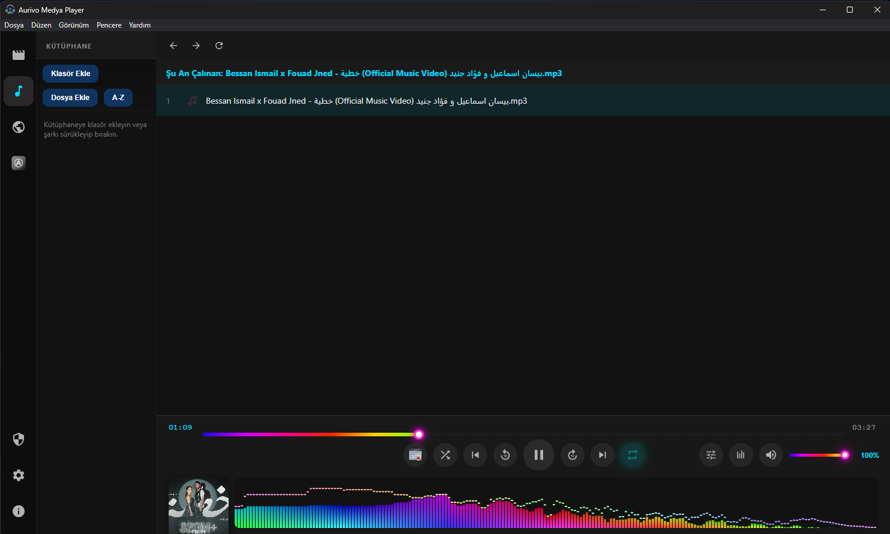
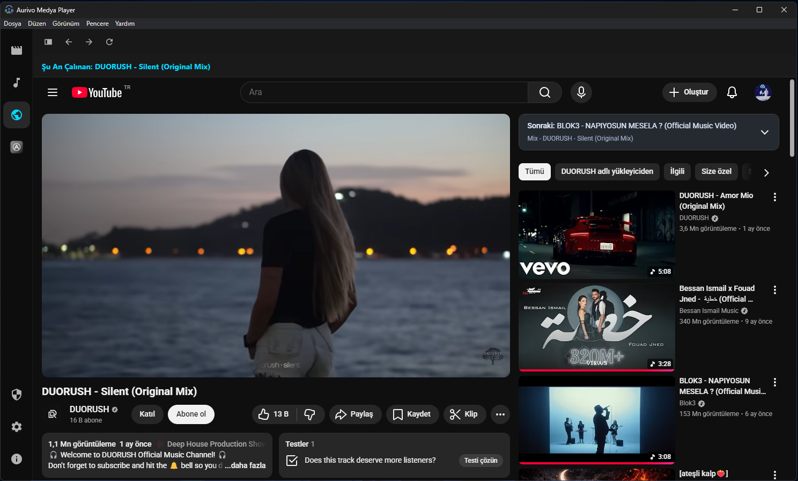
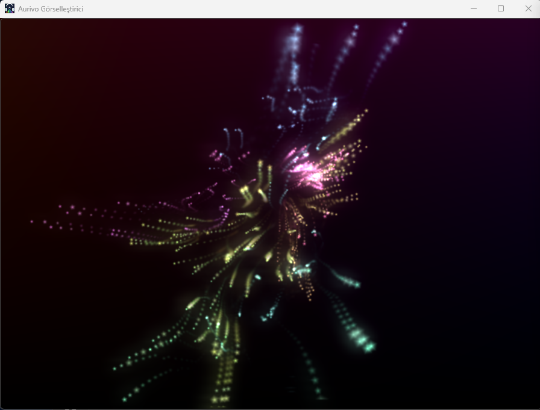
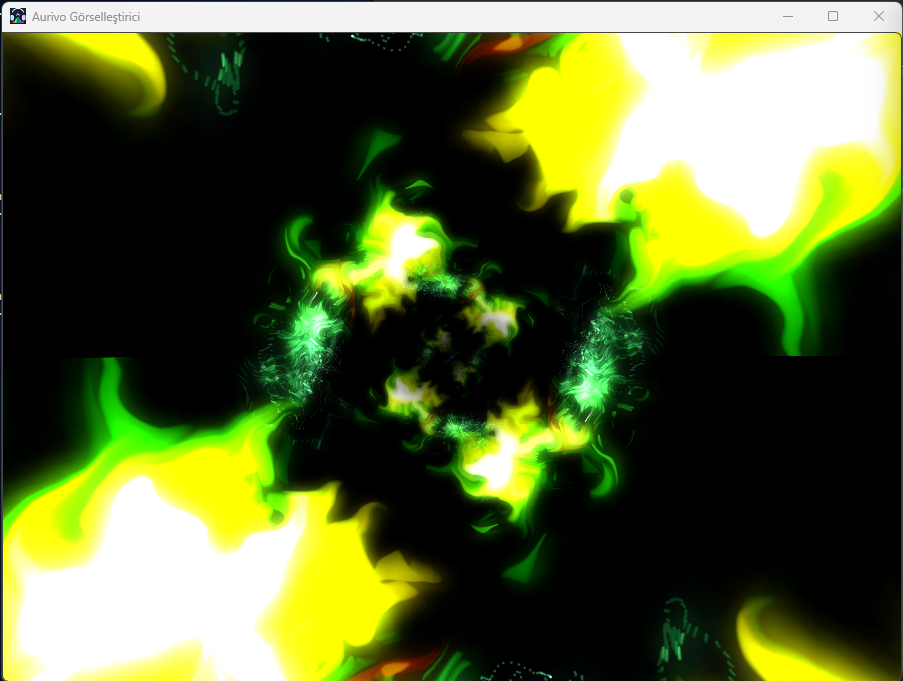

  

<h1 align="center">Aurivo Media Player</h1>

  Electron tabanlı gelişmiş medya oynatıcı (Windows + Linux).

  
  
  
  

  
  
  
  

> Not: macOS paketi bu depoda hedeflenmiyor.

## Özellikler
- Müzik + video oynatma
- Gelişmiş ses efektleri / ekolayzır (BASS tabanlı)
- **projectM görselleştirici** (uygulama içinden açılır; mikrofon/sistem yakalama kullanmaz)
- Aurivo-Dawlod (indirici modülü) entegrasyonu
- Çoklu dil (TR/EN/AR) ve sistem diline uyum

## Screenshots

Goster / Gizle

## İndirme / Kurulum
En güncel sürümü **Releases** sayfasından indir:
- Windows: `Aurivo-<version>-win-x64.exe` (NSIS installer)
- Linux:
  - `Aurivo-<version>-linux-x86_64.AppImage` (en geniş uyumluluk)
  - `Aurivo-<version>-linux-amd64.deb` (Debian/Ubuntu tabanlılar)
  - `Aurivo-<version>-linux-x86_64.rpm` (Fedora/openSUSE tabanlılar)

### Dağıtım uyumluluğu (özet)
- Arch tabanlılar: Arch, CachyOS, EndeavourOS, Manjaro, Garuda
- Debian/Ubuntu tabanlılar: Debian, MX Linux, Mint, Ubuntu, Pop!_OS, Zorin, AnduinOS
- Fedora tabanlılar: Fedora, Nobara, Bazzite
- openSUSE tabanlılar: openSUSE

## Güncellemeler
- **Windows:** uygulama içinden otomatik güncelleme (GitHub Releases).
- **Linux:** AppImage için güncelleme akışı desteklenir; `deb/rpm` kurulumlarında güncelleme paket yöneticisi üzerinden yapılır.

## projectM Görselleştirici
Visualizer ayrı bir native binary’dir:
- Windows: `resources/native-dist/aurivo-projectm-visualizer.exe`
- Linux: `resources/native-dist/aurivo-projectm-visualizer`

Teknik detaylar için: `visualizer/README.md`

## Hizli Baslangic (Windows)
1. Gerekenler
   - Node.js (LTS)
   - Visual Studio Build Tools (C++ ile)
   - CMake, Ninja
   - MSYS2 (mingw64)

2. Kurulum
   - npm ci
   - cd native; npm ci; cd ..

3. Visualizer derleme
   - cmake -S visualizer -B build-visualizer
   - cmake --build build-visualizer --config Release
   - Copy-Item build-visualizer\aurivo-projectm-visualizer.exe native-dist\aurivo-projectm-visualizer.exe -Force

4. Windows build
   - npm run prepare:win:resources
   - npm run build:win

## Hızlı Başlangıç (Linux)
> Uygulama paketleri CI ile üretilir. Lokal derleme istersen:
- `npm ci`
- `npm --prefix native ci`
- `cmake -S visualizer -B build-visualizer -G Ninja -DCMAKE_BUILD_TYPE=Release && cmake --build build-visualizer`
- `npm run build:linux`

## Dizinler
- `native-dist`: görselleştirici binary + runtime dosyaları
- `dist`: electron-builder çıktıları

## Katkı
- Hata bildirimi / öneri: Issues
- PR: `CONTRIBUTING.md`
